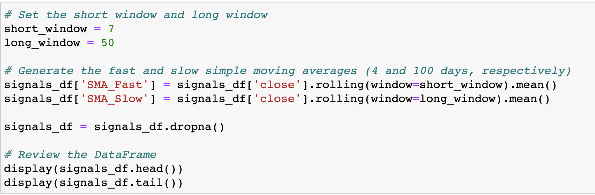
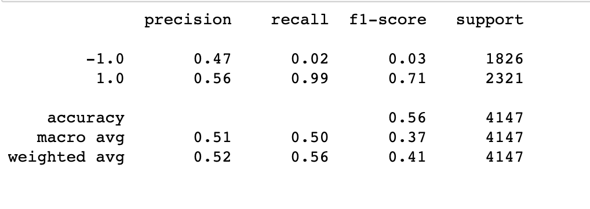
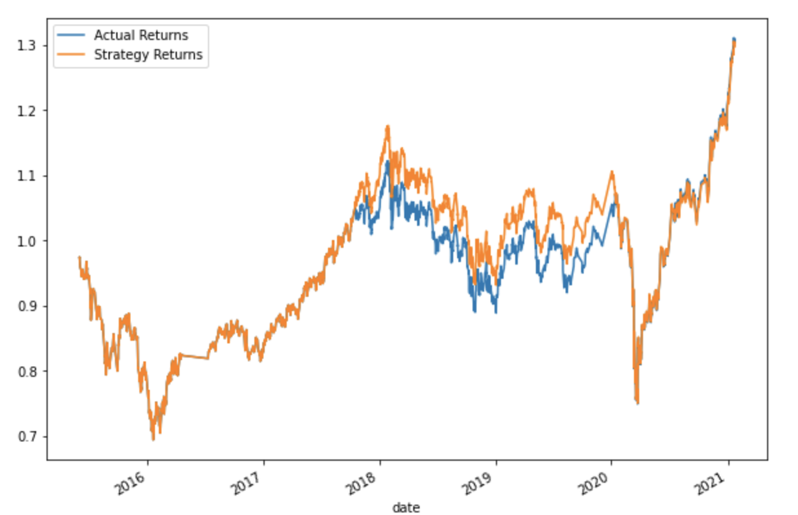
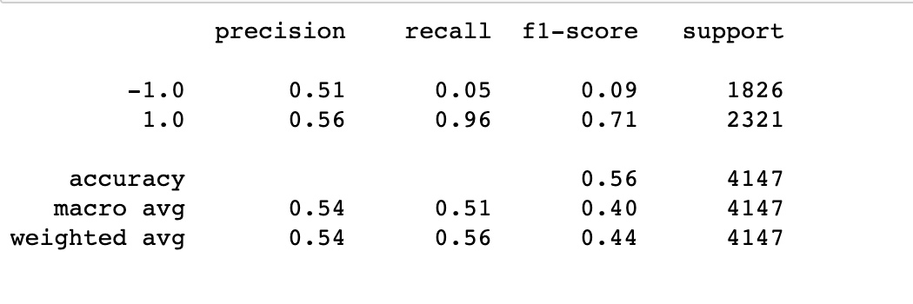
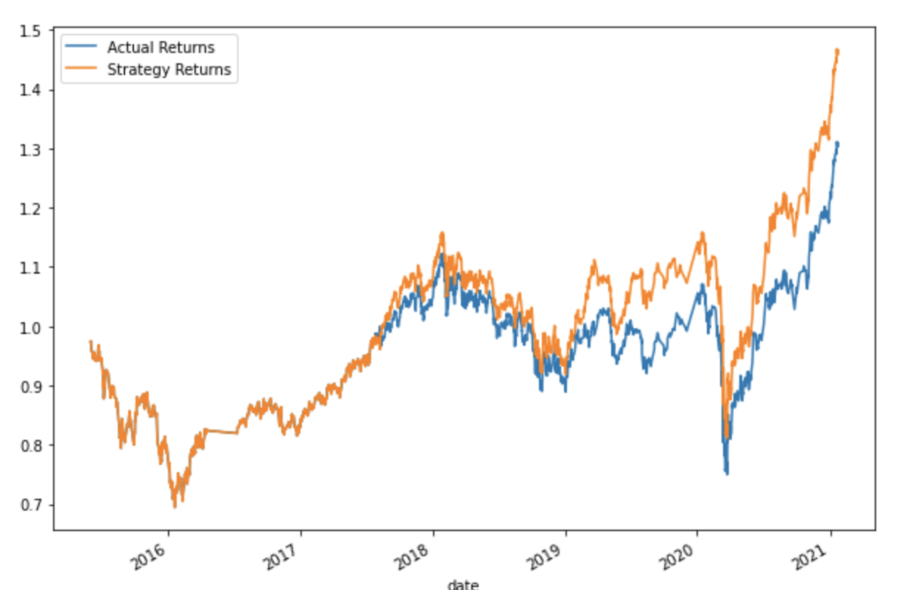

# Machine_Learning_Trading_Bot

## Additional Trading Models

### Simple Moving Average (SMA):
* Short Window = 7 Days
* Long Windo = 50 Days

### Trial 3 Summary:
* Model: SVC Classifier

### Classification Report:

### Cumulative Return Plot: Actual vs. Strategy

### Trial 4 Summary:
* Model: AdaBooster

### Classification Report:

### Cumulative Return Plot: Actual vs. Strategy

## Overall Summary
### Looking over all models, Summary 4 with AdaBooster Classifer and windows, short = 7 and long = 50, seemed to be the best of all. Model 4 seems to be the best fitted for this dataset.
